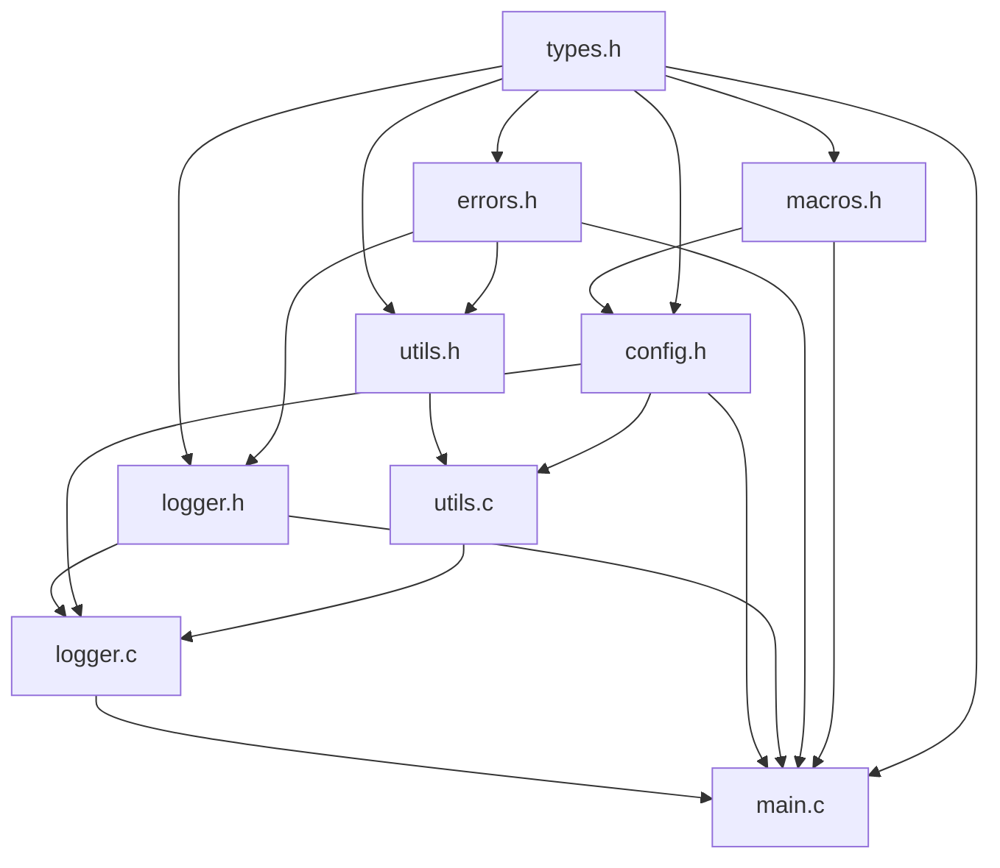

# Phase 0: Foundation - Walkthrough

## Status: COMPLETE


## Build & Run Results

```
       Achilles Search Engine v0.1.0
       Build: Debug   | Jul  3 2026

[2026-07-03 22:28:55] [INFO ] Achilles Search Engine starting...
[2026-07-03 22:28:55] [INFO ] Version: 0.1.0
[2026-07-03 22:28:55] [DEBUG] Debug logging is enabled
[2026-07-03 22:28:55] [INFO ] Achilles Search Engine shutting down...
```

**Compiler:** GCC 15.1.0 | **Zero warnings** | **Zero errors** | **Clean link**


## Files Created (11 total)

### Build & Config

| File | Purpose |
|------|---------|
| [CMakeLists.txt](file:///d:/Projects/Achilles-Search/CMakeLists.txt) | Build system: C17, /W4, Unicode, explicit sources |
| [.gitignore](file:///d:/Projects/Achilles-Search/.gitignore) | Excludes build/, IDE files, runtime data |

### Headers (Public API) — `include/common/`

| File | Purpose | Dependencies |
|------|---------|--------------|
| [types.h](file:///d:/Projects/Achilles-Search/include/common/types.h) | `u8`-`u64`, `i8`-`i64`, `f32`/`f64`, `usize`, `byte` | `<stdint.h>`, `<stdbool.h>` |
| [macros.h](file:///d:/Projects/Achilles-Search/include/common/macros.h) | `ACH_MIN`, `ACH_MAX`, `ACH_ARRAY_LENGTH`, `ACH_ALIGN_UP`, `ACH_KB/MB/GB` | `types.h` |
| [errors.h](file:///d:/Projects/Achilles-Search/include/common/errors.h) | `AchErrorCode` enum, `ach_error_to_string()`, `ACH_TRY` macro | `types.h` |
| [config.h](file:///d:/Projects/Achilles-Search/include/common/config.h) | Version strings, path limits, buffer sizes, static asserts | `types.h`, `macros.h` |
| [utils.h](file:///d:/Projects/Achilles-Search/include/common/utils.h) | `utils_get_timestamp()` | `types.h`, `errors.h` |
| [logger.h](file:///d:/Projects/Achilles-Search/include/common/logger.h) | `LOG_INFO/DEBUG/WARNING/ERROR/FATAL`, `logger_init/shutdown` | `types.h`, `errors.h` |

### Implementation — `src/`

| File | Purpose |
|------|---------|
| [utils.c](file:///d:/Projects/Achilles-Search/src/common/utils.c) | Thread-safe timestamp via `localtime_s()` |
| [logger.c](file:///d:/Projects/Achilles-Search/src/common/logger.c) | Console coloring via Win32 API, optional file logging |
| [main.c](file:///d:/Projects/Achilles-Search/src/main.c) | Thin orchestrator: banner → init → log → shutdown |


## Dependency Graph



> [!IMPORTANT]
> **No circular dependencies.** Every arrow points downward. `types.h` is the root; `main.c` is the leaf.


## Key Systems Programming Concepts in Phase 0

### 1. Module Encapsulation in C
The logger uses a **file-scoped static struct** (`static LoggerState g_logger`). This is C's version of a private class member — no other translation unit can see it. We get encapsulation without OOP.

### 2. Error Propagation Without Exceptions
The `ACH_TRY` macro gives us exception-like propagation:
```c
AchErrorCode init(void) {
    ACH_TRY(logger_init(&config));   // returns error if this fails
    ACH_TRY(scanner_init(&config));  // only runs if logger succeeded
    return ACH_SUCCESS;
}
```

### 3. Thread-Safe Time Formatting
`localtime()` returns a pointer to a static internal buffer — a data race in multithreaded code. We use `localtime_s()` (MSVC/Windows) which writes to a caller-provided struct.

### 4. Win32 Console Coloring
We use `SetConsoleTextAttribute()` rather than ANSI escape codes. ANSI requires `SetConsoleMode(ENABLE_VIRTUAL_TERMINAL_PROCESSING)` which can fail on older Windows. The Win32 API works universally.

### 5. Stack-Based Formatting
`logger_log()` formats messages on the stack (`char message[2048]`). No heap allocation per log call. This matters when logging in hot paths — `malloc` is ~100ns, stack allocation is ~0ns.


## Code Review Notes

### What's Good
- **Zero warnings** at `/W4` level — clean code from day one
- **No global variables** — logger state is module-private
- **Every public function returns `AchErrorCode`** — consistent error handling
- **Compile-time validation** — `_Static_assert` catches misconfigured constants
- **Comments explain WHY, not WHAT** — comments document design decisions

### Improvement Opportunities (Future Phases)
| Item | When | Why |
|------|------|-----|
| Thread safety for logger | Phase 8 | Add `SRWLOCK` around write path |
| Ring buffer for log output | Phase 10 | Avoid `fprintf` overhead in hot paths |
| Log file rotation | Phase 10 | Prevent unbounded log file growth |
| Structured logging (JSON) | Phase 11 | Machine-parseable logs for analysis |


## What's Next: Phase 1 — Filesystem Scanner

Phase 1 will build the **filesystem scanner** — the module that walks directory trees and discovers files. This is the data acquisition layer that feeds everything else.

**Key concepts in Phase 1:**
- Win32 `FindFirstFileW` / `FindNextFileW` API
- Depth-first vs breadth-first traversal (and why DFS is better for filesystems)
- Unicode path handling (`wchar_t` vs `char`)
- Handling junction points, symlinks, and reparse points
- Performance: why `NtQueryDirectoryFile` is faster than `FindFirstFile`

> [!TIP]
> Before starting Phase 1, we need the **Dynamic Vector** (Phase 2) to store discovered files. So the actual order will be: **Phase 2 (Vector) → Phase 1 (Scanner)**. Data structures before algorithms — always.


Let me know when you're ready to proceed!
